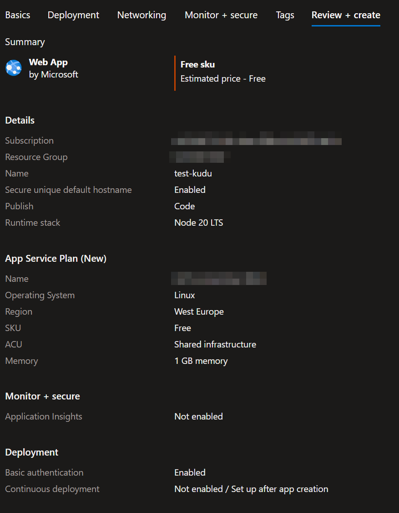
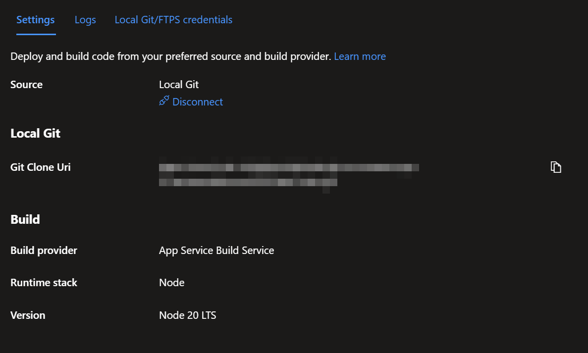

Este ejemplo mínimo reproduce un problema donde el servicio de compilación de Azure App Service (Kudu) no puede ejecutar el script `deploy.sh` por defecto, ya que no encuentra ninguna versión de Node.js en `/opt`.

El mensaje de error generado durante el push es:  
`Error: Unable to locate Node.js installation directory at /opt/nodejs`  
`at Object.<anonymous> (/opt/Kudu/KuduConsole/Scripts/selectNodeVersion.js:166:11)`

Se puede ver el error en la [consola de Kudu](https://<APP_SERVICE_NAME>.scm.westeurope-01.azurewebsites.net/newui/kududebug) ejecutando el siguiente comando:  
`node "/opt/Kudu/KuduConsole/Scripts/selectNodeVersion" "/home/site/repository" "/home/site/wwwroot" "/tmp/8dd3ad6dd421d1b"`

Además, es posible comprobar las versiones de Node.js faltantes ejecutando `ls /opt`, también en la [consola de Kudu](https://<APP_SERVICE_NAME>.scm.westeurope-01.azurewebsites.net/newui/kududebug).

### La instancia del servicio de aplicaciones se creó con Node.js 20 LTS y la configuración de despliegue está establecida en Git local.  
  
