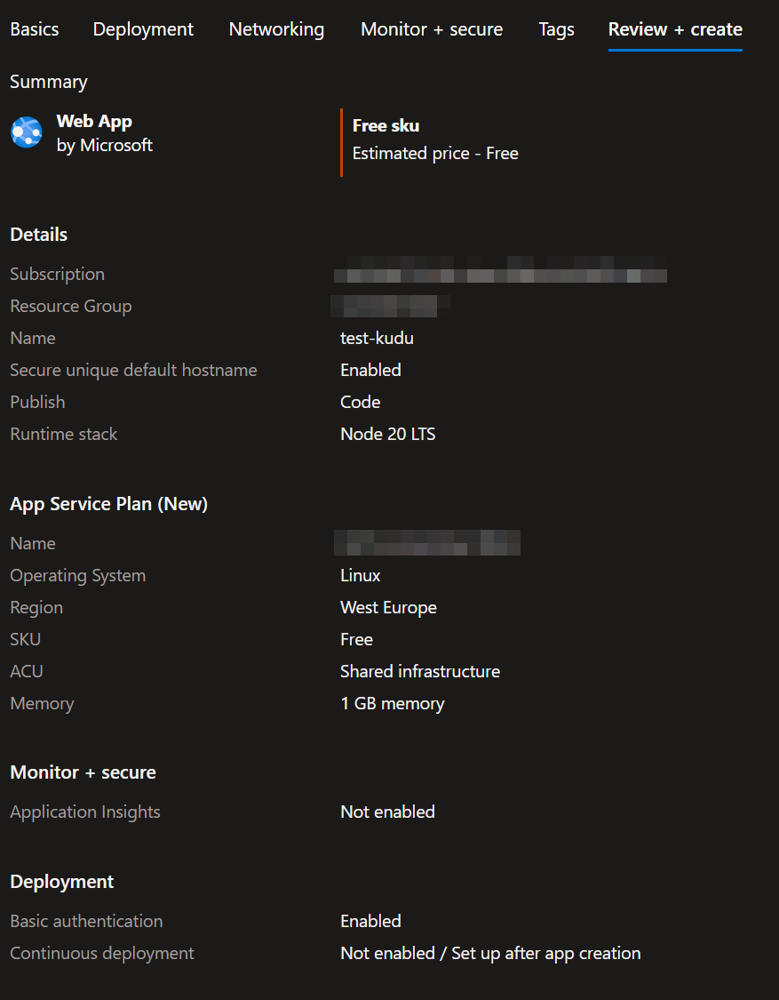

## This minimal example reproduces an issue where Azure App Service's Build Service (Kudu) fails to run the default `deploy.sh` script because it cannot find any Node.js versions at `/opt`.

The error message thrown during the push is:  
`Error: Unable to locate Node.js installation directory at /opt/nodejs`  
`at Object.<anonymous> (/opt/Kudu/KuduConsole/Scripts/selectNodeVersion.js:166:11)`

You can view the error in the [Kudu console](https://<APP_SERVICE_NAME>.scm.westeurope-01.azurewebsites.net/newui/kududebug) by running the following command:  
`node "/opt/Kudu/KuduConsole/Scripts/selectNodeVersion" "/home/site/repository" "/home/site/wwwroot" "/tmp/8dd3ad6dd421d1b"`

Additionally, you can check for missing Node.js versions by running `ls /opt`, also in the [Kudu console](https://<APP_SERVICE_NAME>.scm.westeurope-01.azurewebsites.net/newui/kududebug).

### The app service instance was created with Node.js 20 LTS, and the deployment configuration is set to Local Git.
  
